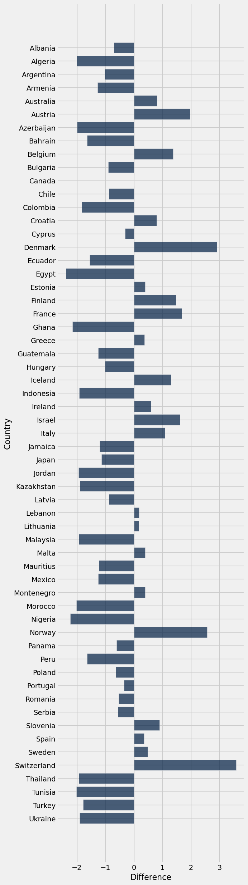

This Program takes information about the pricing of Coca Cola cans(0.33 liters) from several countries and produces tables, and graphs using that information, as displayed below.

## What is purchasing power parity?
Purchasing power parity is when you measure and compare the price of a certain good in different countries to determine the ability of different currencies to purchase said good.

## Coca Cola?
Otherwise known simply as Coke, this is a soft drink sold around the world and easily recognized by its distinctive red can with its unique font.

## Program Step by Step
following this will be a step by step explanation of the code going through each individual cell. The first cell will begin at the number "1" and all future cells will count up. Cells that are entirely commented out will be ignored.

## 1:
The first cell is here to import most of the needed packages for the rest of the program.

## 2:
This cell is here for the creation of the "scrape_table" function. This function will help with every table that is taken from the internet by turning said tables into formats readable by the rest of our code.

## 3:
This Cell scrapes a table of the price of a 0.33 litre coke in 104 countries. These prices are in Canadian Dollars.

## 4:
Cell 4 creates the "Convert" function which uses an api to convert a number in one currency to another currency. It should be noted that this particular API requires an API key which can become non functional. If you need to use this function and get a 403 error code you will need a new API key which can be gotten for free at currencyscroop.com.

## 5:
This cell scrapes a table containing country names and currency codes. We will use this to get the currency codes in our table of coke prices.

## 6:
This cell defines the "get_currency_code" and "clean_currency_code" and uses them to take the currency codes from the table scraped in the previous cell, and attach them to the table with coke prices. An astute observer might notice that we used the ".apply" function instead of ".join". This is becuase in the table with the currency codes all country names were in all capital letters and to use ".join" we would have had to use ".apply" regardeless to alter capitalization. 

## 7:
This relatively large cell is here to add tax rates to our price table. Specifically, we scraped a table of Value Added Tax(VAT) rates by country. These rates were in percentages and also placed into strings in the original table. Having to isolate the actual number from the string, remove any countries where we could not get an actual VAT rate, and converting the rates into floats is why this particular cell is longer then most others.

## 8:
Here we join the VAT rate table and out prices table so that our prices table has a VAT rate for each country. This significantly reduces the size of our table down to 60 on account of us not being able to get every countries VAT rate in a reasonable manner in the VAT rate table.

## 9:
Using the the VAT rates from the previous cell we apply them to the Price in CAD. We then, using the "convert" function from earlier, convert all currencies into a new column with the prices in the local currency.

## 10:
This cell simply takes the price in CAD for each country and subtracts it by the price in Canada, to find the difference in prices. This means that for any difference that is negative, the CAD price in that country is lower then in Canada.

## 11:
Here we create a horizontal bar graph denoting the price in CAD by country. We also remove Singapore from the list given that the price was far higher then in any other country distorting the graph.

## 12:
This cell scrapes a table from wikipedia denoting the obesity rates in percentage by country. The reasoning behind choosing obesity rates as a potenital external factor will be explained in a later section.

## 13
Our final cell joins the table of obesity rates and prices, drops all columns other then obesity rate, price in CAD, and price differnce columns.
We then create a horizontal bar graph to show how these might. effect each other. We chose to include the price in CAD column for clarity so people dont become as easily confused by the small and occassionaly negative difference column.

## External Factor:
For this program we wanted to see if obesity rates were correlated with price differences in Canadian dollars. We had initially presumed that we might find such a correlation due to the sugary, and gennerally unhealthy nature of the drink. The assumption was that in countries that were more obese you would see more soda sales gennerally and with that more Coke sales. Increased sales would drive prices lower to get ahead of the competition and thus we expected to see that where obesity rates were high the difference in CAD price would be very negative. This did not turn out to be the case. To our shock the correlation using np.corrcoef() was just 0.071. 

## Conclusion:
While I was suprised by the lack of any seeming correlation in obesity rates, something I was not suprised by was the fact that Canada is certainly not the cheapest place to buy a sweet can of Coke. In fact, amongst 58 other countries, 36 had cheaper cokes while 28 had more expensive cokes, and 1 had an equal price. Another point of interest was the fact that some countries such as Norway, and Sweden have amongst the highest prices for coke while the lowest rpcies tend to be seen in countries like Nigeria, and Egypt. Though again, no similarities can be drawn from the obesity rates. Something to ponder I suppose.
